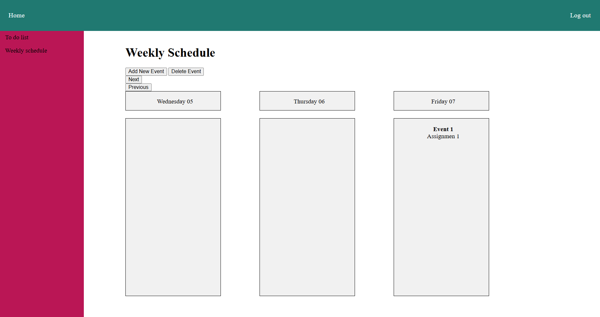
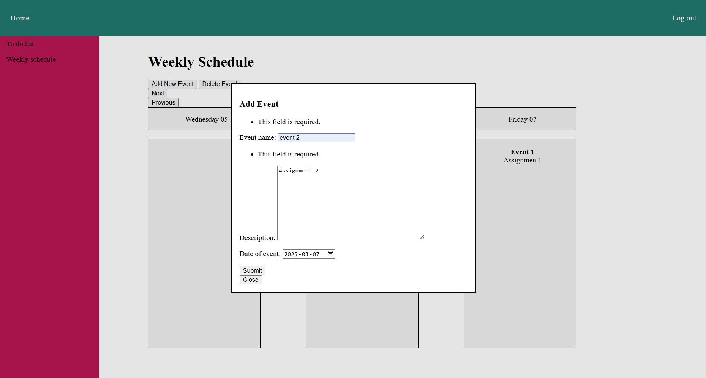
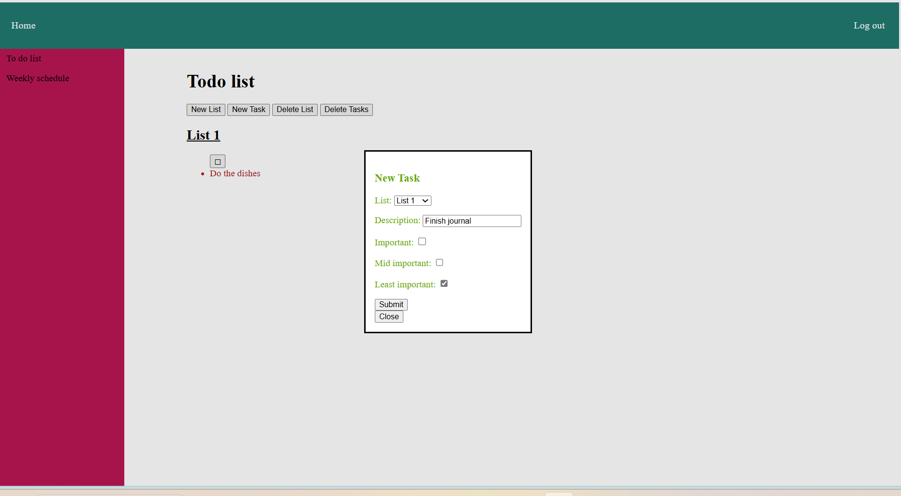
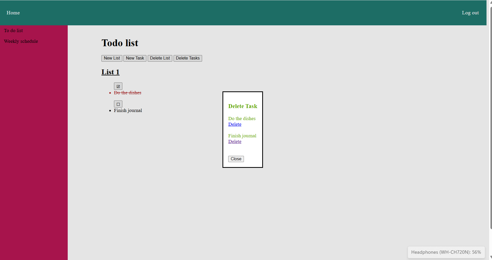
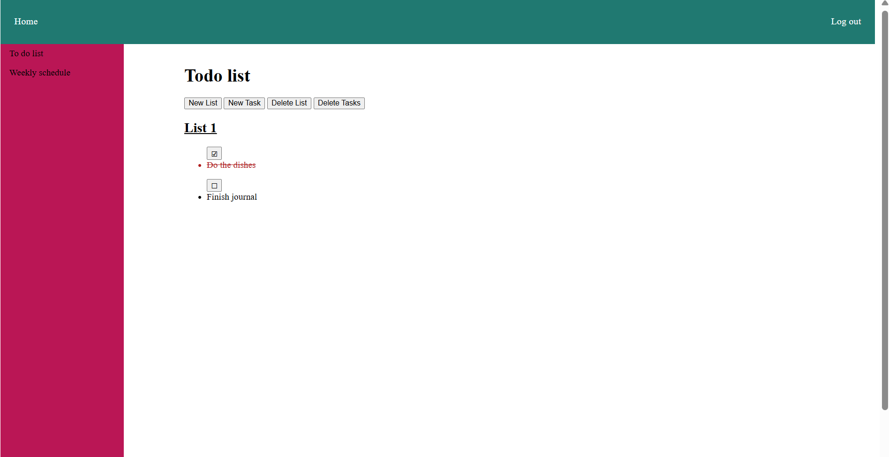

Bita Khoshnazar : 101299553 
Stefanii Shevtsova : 101318109,
Molomey Koffi : 101309961
Anuoluwapo.Ola-Audu: 101220404, 
Mariya Neyra Alvarado : 101317539

Description of application:
This is a web based application designed to help students organise their time, tasks and schedules in a single platform.
Users can personalise their schedule by adding and removing events from the calendar and see a more detailed view in the weekly schedule. 
Users also have a to-do list to add tasks such as assignments or daily chores.

Screenshots of application: 

