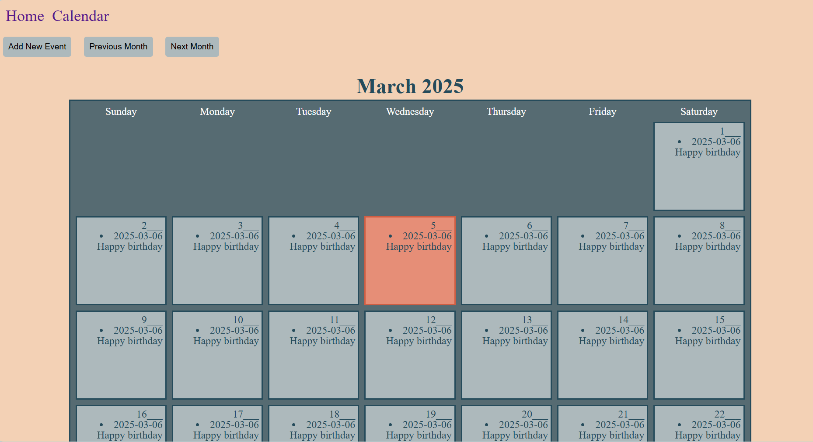

Bita Khoshnazar : 101299553 
Stefanii Shevtsova : 101318109,
Molomey Koffi : 101309961
Anuoluwapo.Ola-Audu: 101220404, 
Mariya Neyra Alvarado : 101317539

Description of application:
This is a web based application designed to help students organise their time, tasks and schedules in a single platform.
Users can personalise their schedule by adding and removing events from the calendar and see a more detailed view in the weekly schedule. 
Users also have a to-do list to add tasks such ass assignments or daily chores.

Screenshots of application: 

1) Clone this with `git clone`
2) Open a terminal in the cloned folder
3) Install dependencies with `pip install -r requirements.txt` (on a lab computer, you can use `C:\Users\Public\ANACONDA\python.exe -m pip install requirements.txt`)
4) Create a file called `.env` in your cloned folder with the value `SECRET_KEY=SOMEVALUE` where `SOMEVALUE` is from this website: https://djecrety.ir/
5) Run the server with `python manage.py runserver`
6) See if it works at http://localhost:8000

